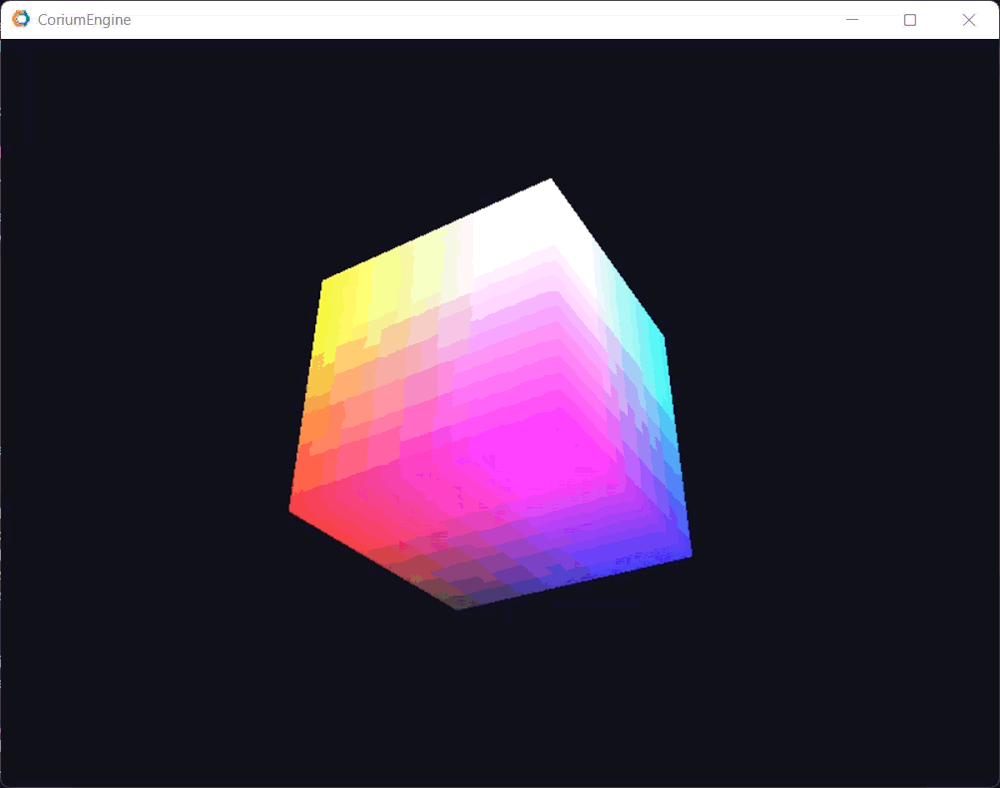

# CoriumEngine 

## /!\ This is a work in progress during my free time:

Changes are happening sometimes months after the last commit, but I still love this type of development, so I hope you will judge it with a good eye ;)

**Demo for the current dev branch content: **

## Libraries

Current libraries used in the project are:
- [DirectX 12](https://learn.microsoft.com/en-us/windows/win32/directx) for rendering

Dependencies are managed using [vcpkg](https://github.com/microsoft/vcpkg)

## Future of the project:

I expect to have a good implementation of the rendering pipeline, with a good architecture, and a good code quality.  
Next I really want to implement a good Window management system and UI with a C# environment to have something a little like Unity.  
The goal for this is to have a little editor to manage the assets and the scenes, without touching the code, and be able to make little POCs of physics simulations, or little games, with the engine.

## Thanks for reading and see you in the next update! :D